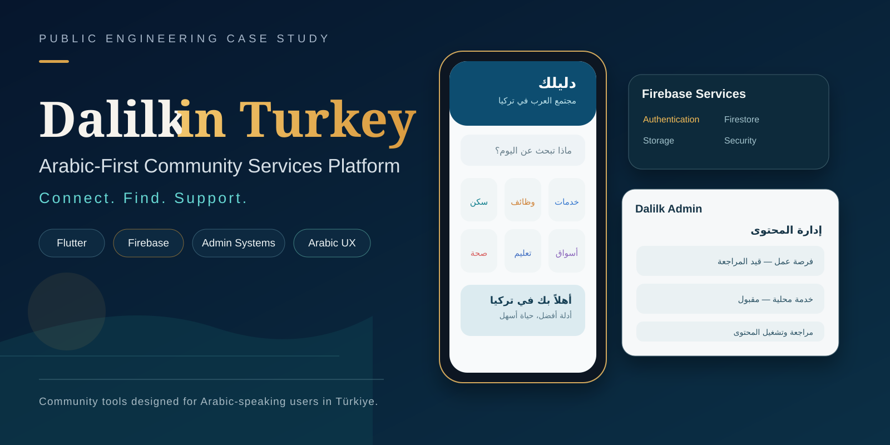
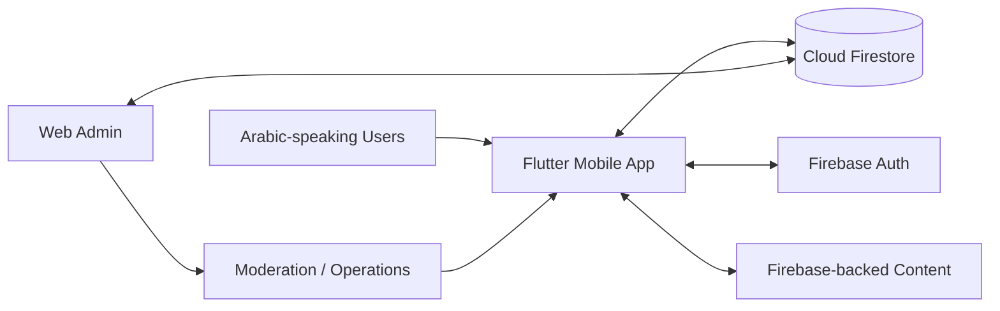

> **Visual overview:** conceptual case-study artwork based on the Arabic mobile, Firebase, and admin workflows. It does not represent live users or production content.

# Dalilk in Turkey — Arabic-First Community Services Platform

**Public engineering case study by [Levent Aydin](https://github.com/LEVENT-AY)**  
Senior Full-Stack, Mobile & AI Automation Engineer

> Production source code and Firebase configuration remain private. This repository documents product architecture, operating model, and engineering scope without exposing customer data or proprietary implementation details.

## 30-second recruiter scan

- **System:** Arabic-first Flutter/Firebase platform covering community services, jobs, transport, healthcare, directories, support, moderation, and administration.
- **My ownership:** Flutter product development, Firebase integration, shared service workflows, admin/moderation tooling, Arabic data quality, and production troubleshooting.
- **What it proves:** I can scale one product across many service domains while keeping user experience, content operations, moderation, and data integrity coherent.

## At a glance

| | |
|---|---|
| **Mobile** | Flutter · Dart |
| **Backend platform** | Firebase Auth · Cloud Firestore |
| **Operations** | Web admin · moderation · support · review workflows |
| **Focus** | Arabic-first UX · multi-domain product design · data integrity |

## The engineering problem

Dalilk in Turkey brings many everyday service categories into one Arabic-first product for Syrians and Arabic-speaking residents in Türkiye. The difficulty is not feature count by itself; it is keeping identity, navigation, data access, moderation, and operations coherent across many domains.

The product therefore treats **customer experience and admin operations as two sides of the same system**.

## Product scope

Jobs · cars and rentals · transport and bookings · doctors and pharmacies · housing/residency workflows · community/chat · news/media · service requests · support and administrative review.

## Architecture

## What I built and owned

- Flutter/Dart mobile application with Arabic-first product patterns.
- Firebase Authentication and Firestore-backed product state.
- Administration surface spanning user-generated and operational content.
- Moderation and pending-review workflows across multiple service domains.
- Public-chat operations, support visibility, and data-repair workflows.
- Arabic text-integrity tooling for detecting and repairing encoding/mojibake issues.
- Shared product patterns that let many service domains coexist inside one application.

## Key engineering decisions

### One platform, many service domains
Shared identity, data access, moderation patterns, and administration reduce duplication while allowing the product to grow into new community needs.

### Admin operations are part of the product
User-facing features remain useful only if providers, requests, reports, and content can be reviewed and operated safely.

### Arabic quality needs technical safeguards
Arabic UX is not only typography and RTL layout. Encoding corruption can damage real content, so integrity checks and repair tooling are explicit engineering concerns.

## Technology

| Area | Technology / focus |
|---|---|
| Mobile | Flutter, Dart |
| Backend | Firebase, Cloud Firestore, Firebase Auth |
| Admin | Web/admin workflows |
| Operations | Moderation, support, content review, data repair |
| Quality | Arabic text integrity + production troubleshooting |

## What this demonstrates

Ownership of a large multi-domain mobile product where UX, Firebase data, moderation, administration, and Arabic data quality all need to operate as one system.

---

**Source policy:** private for IP, customer-data, and operational-security reasons. No proprietary source code, credentials, or Firebase configuration are published here.

[← Back to my engineering profile](https://github.com/LEVENT-AY)
