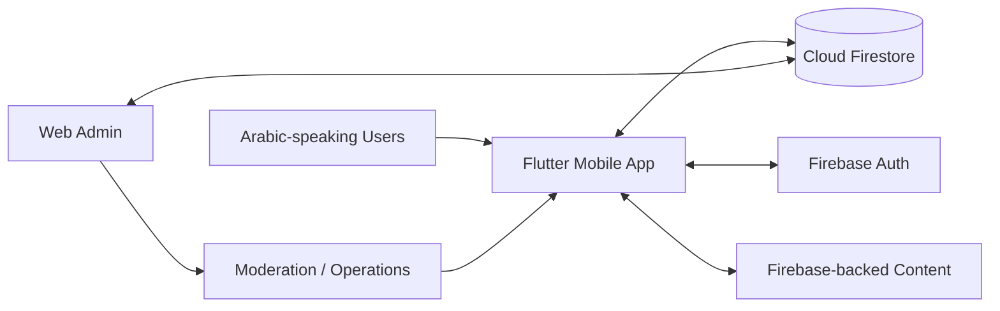

> **Visual overview:** conceptual case-study artwork based on the Arabic mobile, Firebase, and admin workflows. It does not represent live users or production content.

# Dalilk in Turkey — Arabic-First Community Services Platform

**Public engineering case study by [Levent Aydin](https://github.com/LEVENT-AY)**  
Senior Full-Stack, Mobile & AI Automation Engineer

> Production source code and Firebase configuration remain private. This repository documents the product architecture, operating model and engineering scope without exposing customer data or proprietary implementation details.

## At a glance

| | |
|---|---|
| **Product type** | Multi-service Arabic community platform |
| **Mobile** | Flutter · Dart |
| **Backend platform** | Firebase Auth · Cloud Firestore |
| **Operations** | Web administration, moderation queues, support and review workflows |
| **Engineering focus** | Arabic-first UX · multi-domain product design · moderation · data integrity |
| **My role** | Flutter product development, Firebase integration, admin tooling, service workflows, data quality and production troubleshooting |

## The engineering problem

Dalilk in Turkey brings many everyday service categories into one Arabic-first product for Syrians and Arabic-speaking residents in Türkiye. The challenge is not simply feature count; it is keeping identity, navigation, data access, moderation and operations coherent across many domains.

The product therefore treats **customer experience and admin operations as two sides of the same system**.

## Product scope

Implemented or operationally supported areas include:

- service and consultation requests;
- jobs and job moderation;
- cars and rentals;
- transport and booking workflows;
- doctors, health specialists and pharmacies;
- housing / residency-oriented forms;
- community groups and public chat;
- news and media content;
- kitchen and cleaning services;
- discovery / live-camera experiences;
- support, reports and administrative review workflows.

## Architecture

## What I built and owned

- Flutter/Dart mobile application with Arabic-first UX.
- Firebase Authentication and Firestore-backed product state.
- Broad administration surface covering user-generated and operational content.
- Moderation and pending-review workflows for jobs, cars, rentals, service requests and reports.
- Admin visibility across community, healthcare, transport, provider and media domains.
- Public-chat operations and data-repair workflows.
- Arabic text-integrity tooling for detecting and repairing encoding/mojibake issues.
- Shared product patterns that allow many service domains to coexist inside one application.
- Operational summaries for urgent work, pending content, support demand and platform activity.

## Core engineering decisions

### 1. One platform, many service domains

Shared identity, data access, moderation patterns and administration reduce duplication while allowing the product to grow into multiple community needs.

### 2. Admin operations are part of the product

User-facing features only remain useful if providers, requests, reports and content can be reviewed and operated safely. The admin surface therefore has its own workflows and queues.

### 3. Arabic quality needs technical safeguards

Arabic UX is not only typography and layout. Encoding corruption can damage real content, so the project includes explicit integrity checks and repair tooling.

## Technology

| Area | Technology / focus |
|---|---|
| Mobile | Flutter, Dart |
| Backend platform | Firebase, Cloud Firestore, Firebase Auth |
| Admin | Flutter web/admin workflows |
| Product | Arabic-first service marketplace/community platform |
| Operations | Moderation queues, support, content review, data repair |
| Quality | Arabic text-integrity checks and production troubleshooting |

## What this demonstrates

Dalilk demonstrates ownership of a **large multi-domain Flutter product** where mobile UX, Firebase data, moderation, administration and Arabic data-quality concerns all need to work as one operational platform.

---

**Source policy:** private for IP, customer-data and operational-security reasons. No proprietary source code, credentials or Firebase configuration are published here.

[← Back to my engineering profile](https://github.com/LEVENT-AY)
